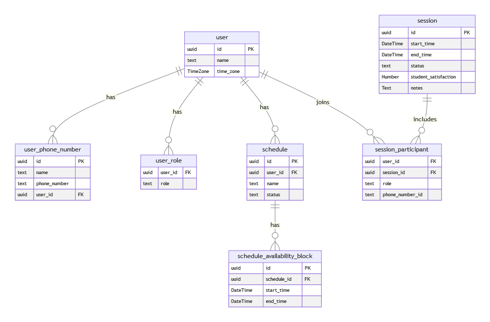

## Getting Started

```bash
npm run install
npm run dev
```

Open [http://localhost:3000](http://localhost:3000) with your browser to see the result.

Note if you need to restart the db, you can run the following command:

```bash
npm run migrate:rollback
npm run migrate
```

then go to "/admin" and click on "Create random users" to create some random users.

## Database Schema



## Things to improve

- tests, auth, validation, error handling, etc
- Incorporate the use of timezones and phonenumbers set by the user instead of local time
- originally wanted to use rule based scheduling, but it was too complex for the time I had available
